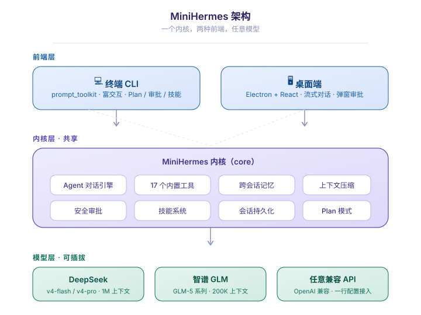
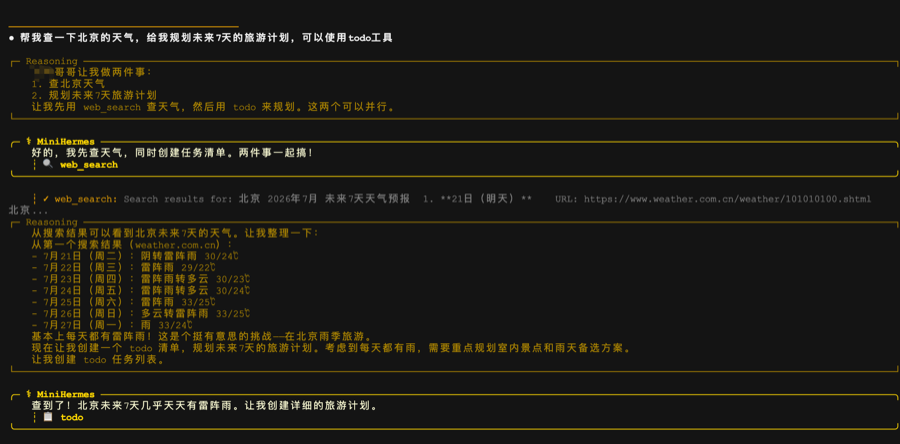
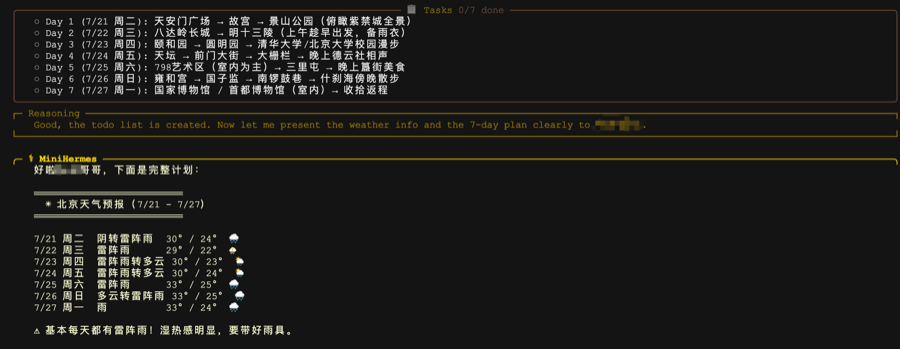
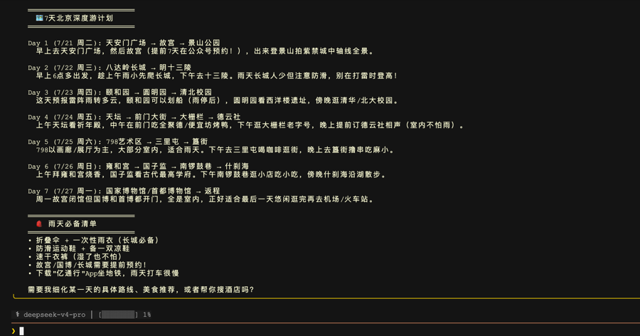

<p align="center">
  
</p>

<h1 align="center">MiniHermes</h1>

<p align="center">
  <b>轻量级 AI 编程助手</b> · 纯 Python · 终端 + 桌面双端
</p>

<p align="center">
  
  
  
  
</p>

---

## 简介

MiniHermes 是一个轻量级的 AI 编程助手：在终端或桌面应用里，用自然语言完成编码、调试、搜索等任务。内置多模型自由切换、工具调用、跨会话记忆与安全审批，开箱即用。

## 架构



一个共享内核，同时驱动终端与桌面两种前端；模型层可插拔，支持 DeepSeek、智谱 GLM 及任意 OpenAI 兼容 API。

## 特性

- **双端形态** — 终端 CLI 与桌面端共享同一内核
- **多模型切换** — 运行时秒切厂商与模型，任意 OpenAI 兼容 API 一行接入
- **17 个内置工具** — 文件读写、命令执行、网页搜索、代码沙箱、图片生成等
- **跨会话记忆** — 自动记住偏好与项目约定
- **长对话不失控** — 五阶段上下文压缩，1M 上下文窗口流畅对话
- **安全有保障** — 危险命令自动拦截，敏感操作弹窗确认
- **Plan 规划模式** — 先出方案、确认后执行
- **技能系统** — 内置技能，一键扩展自定义

## 快速开始

```bash
# 安装
pip install minihermes

# 或源码运行
git clone https://github.com/Manner-zhaixing/miniHermes.git
cd miniHermes
uv sync
python main.py

# 启动
minihermes
```

首次启动进入配置向导：选择厂商 → 填入 API Key → 选择模型。

## 基本操作

| 操作 | 方式 |
|------|------|
| 发送消息 | `Enter` |
| 多行输入 | `Ctrl+J` |
| 中断回复 | `Ctrl+C` |
| 退出 | `/exit` 或 `Ctrl+D` |
| 规划模式 | `/plan <描述>` |
| 切换厂商 / 模型 | `/provider glm` / `/model deepseek-v4-pro` |
| 加载技能 | `/code-review` |
| 引用文件 | `@file:path/to/file.py:30-50` |

## 文档

详细架构与模块文档见 [`docs/`](docs/)：

| 文档 | 内容 |
|------|------|
| [整体架构](docs/整体架构.md) | 架构设计总览 |
| [调用链路](docs/01-call-chain.md) | 消息处理主流程 |
| [系统提示词](docs/02-system-prompt.md) | 12 层提示词组装 |
| [上下文压缩](docs/03-context-compression.md) | 五阶段压缩策略 |
| [记忆系统](docs/04-memory.md) | 双轨道记忆 |
| [工具系统](docs/05-tools.md) | 工具注册与审批 |
| [Provider](docs/06-provider.md) | LLM API 封装 |
| [Agent 引擎](docs/07-agent.md) | 对话循环与子 Agent |
| [CLI 界面](docs/08-cli.md) | 终端 UI |
| [会话持久化](docs/09-session.md) | SQLite + FTS5 |

## 演示








## License

MIT
