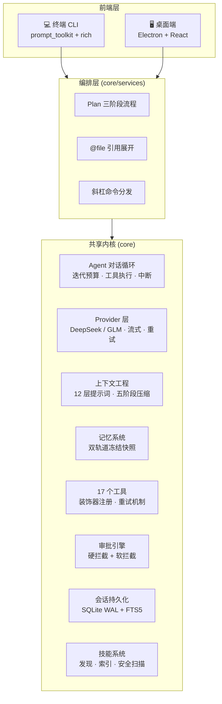
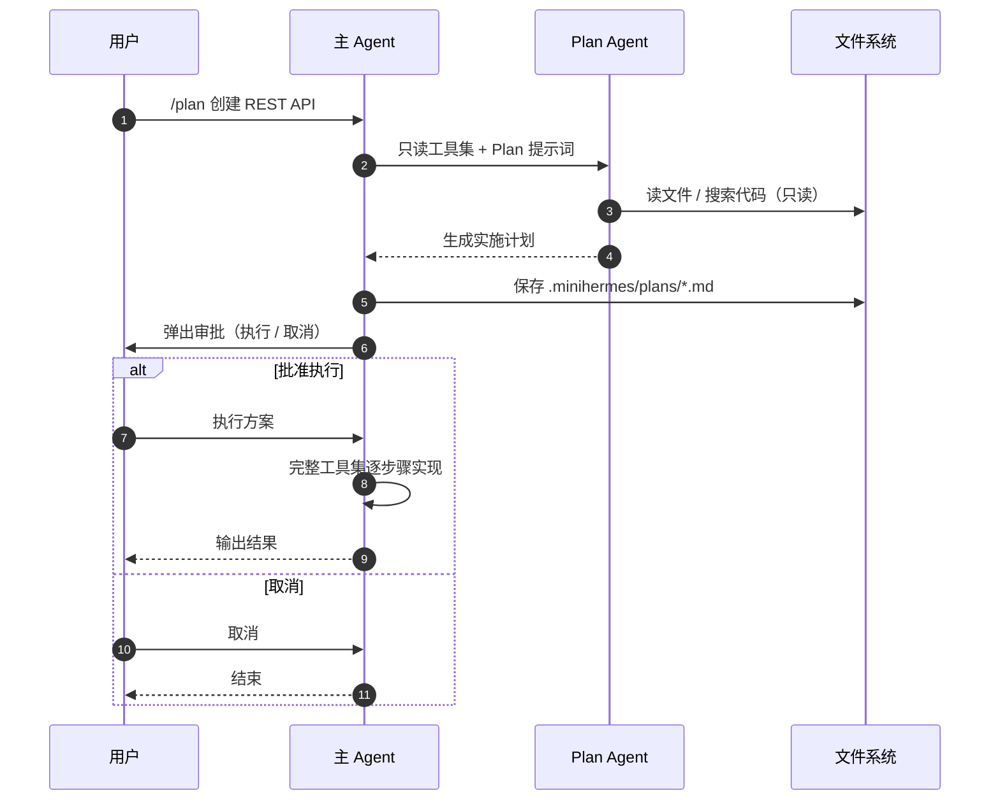
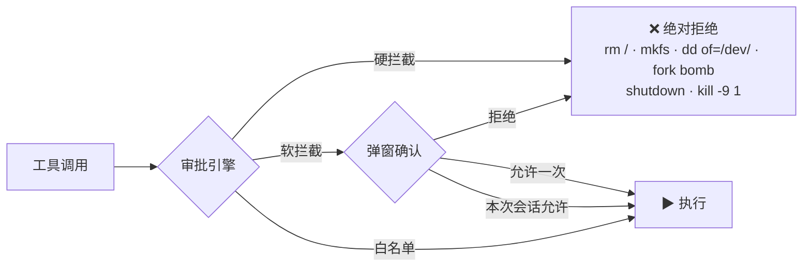

<p align="center">
  
</p>

<h1 align="center">MiniHermes</h1>

<p align="center">
  <b>轻量级 AI 编程助手</b> · 纯 Python · 双前端（终端 CLI + 桌面端）
  <br/>
  OpenAI 兼容 API · 工具调用 · 跨会话记忆 · 上下文压缩 · 技能系统
</p>

<p align="center">
  
  
  
  
</p>

---

## ✨ 特性总览

| 维度 | 亮点 |
|------|------|
| 🖥 **双端形态** | 终端 CLI（prompt_toolkit 富界面）+ 桌面端（Electron + React），共享同一内核 |
| 🔌 **多厂商** | 内置 DeepSeek / 智谱 GLM 预设，运行时 `/provider` `/model` 秒切，支持任意 OpenAI 兼容 API |
| 🛠 **17 个内置工具** | bash / 文件读写 / 网页搜索提取 / 代码沙箱执行 / 图片生成 / 子 Agent 委派… |
| 🧠 **跨会话记忆** | 双轨道（MEMORY.md + USER.md）冻结快照，会话间知识自动传递 |
| 📦 **上下文压缩** | 五阶段结构化压缩，长对话不失控（1M 上下文窗口 + 自动摘要） |
| 🛡 **安全审批** | 硬拦截（危险命令绝对拒绝）+ 软拦截（弹窗审批）+ 敏感路径/内容检测 |
| 📋 **Plan 模式** | 只读分析 → 生成实施计划 → 审批 → 执行，四阶段完整流程 |
| 🧩 **技能系统** | 内置技能 + 条件激活 + 安全扫描，可自定义扩展 |
| 💾 **会话持久化** | SQLite WAL + FTS5 全文搜索，压缩链路 session 自动分裂 |

---

## 🏗 架构总览



**设计原则**：`core/` 是前端无关的共享内核，`cli/` 与 `desktop/` 是两种前端形态；`services/` 是双端复用的编排层。桌面端通过 `GuiRenderer` 实现内核渲染接口，审批/澄清走 WebSocket 弹窗。

---

## 🚀 快速开始

### 终端 CLI

```bash
# 全局安装（wheel）
pip install minihermes

# 或源码运行
git clone https://github.com/Manner-zhaixing/miniHermes.git
cd miniHermes
uv sync
python main.py

# 启动交互式对话
minihermes
```

首次启动自动进入配置向导：选择厂商（DeepSeek / 智谱 GLM）→ 填入 API Key → 选择模型。

### 桌面端

```bash
cd desktop
npm install
npm run dev        # 开发模式（自动拉起 Python 后端）
npm run dist:mac   # 打包 DMG 安装包
```

> 桌面端依赖 Python 内核（`desktop/backend/server.py`），通过 WebSocket/HTTP 双向通信，详见 [desktop/README.md](desktop/README.md)。

---

## ⚙️ 多厂商 Provider

预设厂商注册表内置在代码中（`core/provider/registry.py`），只需填 API Key 即可使用：

```yaml
# ~/.minihermes/config.yaml
provider:
  active: "deepseek"          # 当前生效厂商
  list:
    deepseek:                 # 空字段 = 用预设默认
      api_key: "sk-..."       # 或环境变量 DEEPSEEK_API_KEY
      base_url: ""            # 空 → https://api.deepseek.com
      model: ""               # 空 → deepseek-v4-flash
      context_window: 0       # 0 → 预设默认
      thinking_effort: ""     # off|low|medium|high|max
    glm:
      api_key: ""
      ...
agent:
  max_iterations: 100
  show_thinking: true
```

| 厂商 | 模型 | 上下文窗口 | 说明 |
|------|------|-----------|------|
| **DeepSeek** | v4-flash / v4-pro | 1M | 输出上限 384K，reasoning_effort 官方支持 |
| **智谱 GLM** | GLM-5 / GLM-5.1 / GLM-5-Turbo | 200K | — |

- 旧版扁平 `model:` 配置自动迁移为 `provider:` + `agent:` 结构
- 运行时切换：`/provider`（列出）、`/provider glm`（切换）、`/model deepseek-v4-pro`——**立即生效，无需重启**
- 新增厂商只需在 `PRESETS` 加一条注册项 + config.yaml 模板同步空覆盖块

---

## ⌨️ 基本操作

| 操作 | 方式 |
|------|------|
| 发送消息 | `Enter` |
| 多行输入 | `Ctrl+J` |
| 中断回复 | `Ctrl+C` |
| 退出 | `/exit` 或 `Ctrl+D` |
| 查看帮助 | `/help` |
| 规划模式 | `/plan <描述>` |
| 加载技能 | `/<skill-name>`，如 `/code-review` |
| 切换厂商 | `/provider`（列出）/ `/provider glm`（切换） |
| 切换模型 | `/model deepseek-v4-pro` |
| 引用文件 | `@file:path/to/file.py:30-50`（自动注入内容） |

---

## 📋 Plan 模式



Plan Agent 工具白名单：`read_file` `list_dir` `web_search` `web_extract` `session_search` `process` `memory` `clarify` `todo` `skill_view`（**不含** bash / write_file / execute_code / delegate_task）。

---

## 🛠 工具系统

17 个内置工具，通过装饰器注册：

| 类别 | 工具 |
|------|------|
| **系统** | `bash`、`process` |
| **文件** | `read_file`、`write_file`、`list_dir` |
| **信息** | `web_search`、`web_extract`、`web_open`（浏览器） |
| **代码执行** | `execute_code`（E2B 沙箱） |
| **记忆** | `memory`（跨会话） |
| **委派** | `delegate_task`（子 Agent，隔离上下文） |
| **交互** | `clarify`（澄清提问）、`todo`（任务规划） |
| **会话** | `session_search`（FTS5 全文搜索） |
| **技能** | `skill_view`、`skill_manage` |
| **视觉** | `generate_image`（Pollinations） |

**容错设计**：工具执行带重试机制（超时自动加倍重试）；bash 输出超长自动截断；LLM 输出半截 JSON 时自动回填错误让模型重新发送。

---

## 🛡 安全审批

两层防线（`core/tools/approval.py`）：



- **硬拦截（HARDLINE）**：绝对不执行——`rm /`、`mkfs`、`dd of=/dev/`、fork bomb、`shutdown`、`kill -9 1`
- **软拦截（DANGEROUS）**：弹出审批 UI——`rm`、`chmod 777`、`git reset --hard`、`git push --force`、`curl | sh`、`sudo`、`DROP TABLE`
- **write_file 独立检测**：敏感路径（`.env` / `.ssh/` / `/etc/`）+ 敏感内容（API_KEY / SECRET 嵌入）

---

## 🗂 项目结构

```
miniHermes/
├── main.py                       # 根入口 shim → minihermes.main
├── pyproject.toml                # hatchling 打包 src/minihermes
├── build_wheel.sh                # uv build 封装
├── src/minihermes/
│   ├── main.py                   # CLI 入口（console script）
│   ├── core/                     # ★ 共享内核（前端无关）
│   │   ├── agent/                # 对话主循环 / 子 Agent 委派
│   │   ├── approval/             # 安全审批引擎
│   │   ├── provider/             # LLM Provider 层 + 厂商注册表
│   │   ├── context/              # 上下文状态 / 五阶段压缩 / token 估算
│   │   ├── prompt/               # 12 层系统提示词组装
│   │   ├── config/               # 配置管理（模板合并）
│   │   ├── tools/                # 17 个工具注册与实现
│   │   ├── session/              # SQLite WAL + FTS5 持久化
│   │   ├── skills/               # 技能发现 / 索引 / 安全扫描
│   │   ├── services/             # ★ 双端复用编排（plan / context_ref / commands）
│   │   └── _builtin_skills/      # 内置技能模板
│   └── cli/                      # ★ 终端前端（prompt_toolkit）
│       ├── conversation.py       # 后台对话循环
│       ├── layout.py  styles.py  keybindings.py  completers.py
│       ├── clarify.py  approval.py  plan_ui.py
│       └── renderer.py           # StreamRenderer 终端渲染
├── desktop/                      # ★ 桌面前端（Electron + React + FastAPI）
│   ├── backend/server.py         # 仅 import minihermes.core.*
│   ├── backend/gui_renderer.py   # GuiRenderer 内核渲染接口实现
│   ├── electron/  src/  resources/
│   └── README.md                 # 桌面端独立文档
├── docs/                         # 详细架构文档
└── asset/                        # 演示截图
```

---

## 🧑‍💻 开发者指南

### 扩展一个新工具

```python
# src/minihermes/core/tools/my_tool.py
from .registry import register

@register({
    "type": "function",
    "function": {
        "name": "my_tool",
        "description": "我的自定义工具",
        "parameters": {"type": "object", "properties": {}, "required": []},
    },
})
def my_tool() -> str:
    return "hello from my tool"
```

### 新增一个厂商

在 `core/provider/registry.py` 的 `PRESETS` 加一条注册项（含模型列表、上下文窗口、默认模型），再在 config.yaml 模板同步一份空覆盖块即可。

### 添加内置技能

在 `_builtin_skills/` 下新建目录，包含 `SKILL.md`（frontmatter：name / description / category），`sync_builtin_skills()` 启动时自动同步到 `~/.minihermes/skills/`。

### 代码规范

- `core/` 禁止 import `cli/`、`prompt_toolkit`、`rich`（保持前端无关）
- `services/` 是 CLI 与桌面复用的编排层
- 中文注释为主，核心类 < 500 行，包内文件 < 10 个

---

## 📚 详细文档

完整架构设计与模块文档见 [`docs/`](docs/)：

| 文档 | 内容 |
|------|------|
| [整体架构](docs/整体架构.md) | 项目总览与架构设计 |
| [调用链路](docs/01-call-chain.md) | 消息处理主流程 |
| [系统提示词](docs/02-system-prompt.md) | 12 层系统提示词组装 |
| [上下文压缩](docs/03-context-compression.md) | 五阶段压缩策略 |
| [记忆系统](docs/04-memory.md) | 双轨道记忆与冻结快照 |
| [工具系统](docs/05-tools.md) | 工具注册、执行、审批 |
| [Provider](docs/06-provider.md) | LLM API 封装 |
| [Agent 引擎](docs/07-agent.md) | 对话循环与子 Agent |
| [CLI 界面](docs/08-cli.md) | prompt_toolkit 终端 UI |
| [会话持久化](docs/09-session.md) | SQLite WAL + FTS5 |

---

## 🖼 演示


---

## 📄 License

MIT
